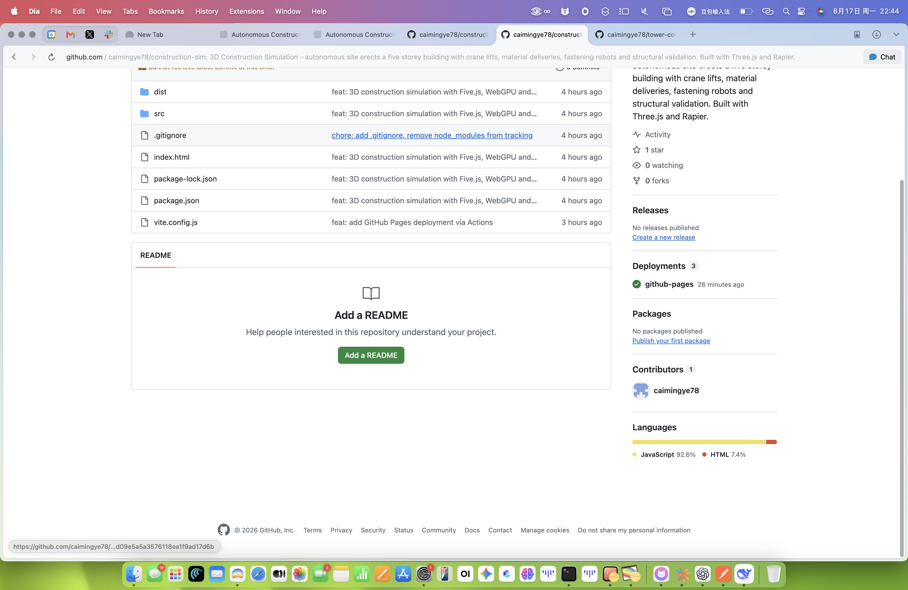

# 🏗️ Tower Construct

**3D Autonomous Construction Simulation** — a five-storey building erected floor by floor by an automated construction site, featuring crane lifts, material deliveries, fastening robots, and real-time structural validation.

Built with [Three.js](https://threejs.org/), [Rapier](https://rapier.rs/) physics engine, and [Vite](https://vitejs.dev/).



---

## ✨ Features

- **🏢 5-Storey Building** — Columns, beams, floor slabs, and wall panels assembled floor by floor
- **🏗️ Tower Crane** — Full 3D crane with slewing jib, trolley, cable, and hook animations
- **🚛 Material Delivery Trucks** — Components arrive on-site via delivery trucks
- **🤖 Assembly Robots** — 4 autonomous robots with sensor lights patrol the construction site
- **✅ Structural Validation** — Each component flashes green when placed and validated
- **📊 HUD Progress Tracker** — Real-time phase display, component count, validation status, and floor progress
- **🎮 Interactive Camera** — Orbit controls: drag to rotate, scroll to zoom

## 🎬 Construction Sequence

The simulation follows a real-world construction workflow:

1. **Foundation** — Site preparation with concrete foundation
2. Per floor: **Columns → Beams → Floor Slab → Wall Panels → Validation**
3. **Roof** — Final roof slab placement
4. **Completion** — All 5 floors validated and structurally sound

## 🛠️ Tech Stack

| Technology | Purpose |
|---|---|
| [Three.js](https://threejs.org/) | 3D rendering engine |
| [Rapier](https://rapier.rs/) | Real-time physics simulation |
| [Vite](https://vitejs.dev/) | Build tool and dev server |
| JavaScript (ESM) | Core logic |

## 🚀 Getting Started

```bash
# Clone the repository
git clone https://github.com/caimingye78/tower-construct.git
cd tower-construct

# Install dependencies
npm install

# Start the development server
npm run dev
```

Then open **http://localhost:5173/tower-construct/** in your browser.

### Build for Production

```bash
npm run build
```

The output will be in the `dist/` directory.

## 🌐 Live Demo

Try the live demo on GitHub Pages:

[https://caimingye78.github.io/tower-construct/](https://caimingye78.github.io/tower-construct/)

## 🎮 Controls

| Action | Control |
|---|---|
| Rotate view | Click and drag |
| Zoom in/out | Scroll wheel |
| Pan | Right-click and drag |

## 📁 Project Structure

```
tower-construct/
├── index.html          # Entry HTML with HUD overlay
├── src/
│   └── main.js         # Core simulation code (878 lines)
├── package.json        # Dependencies and scripts
├── vite.config.js      # Vite configuration
└── README.md           # This file
```

## 📜 License

MIT
